By: Jacob Platt

# Table of Contents

---

1. Introduction and prerequisites to Raspberry Pi Setup
2. Hardware assembly and component identification
3. Operating system installation (Raspberry Pi OS Lite)
4. Initial system configuration
5. SSH setup and security
6. VS Code remote development setup
7. Testing and verification
8. Next steps and resources

---

# Introduction

In this technical procedure.... (Explain why we use a monitor to set up the Pi and headless configuration, and why a monitor is required despite being headless, explain how to get started w/o monitor)

#### Items Required

1. Power for 5V (Adapter for Wall outlet/ powerstrip)
2. Raspberry Pi Board
3. Raspberry Pi Case
4. Cat5 or better ethernet cable
5. Power Cable USB-C
6. Micro USB to HDMI cable
7. MicroSD card
8. MicroSD reader
9. Keyboard
10. Mouse
11. Monitor

#### Tools Required

1. Small screwdriver
2.

# 1.Introduction and prerequisites to Raspberry Pi Setup

 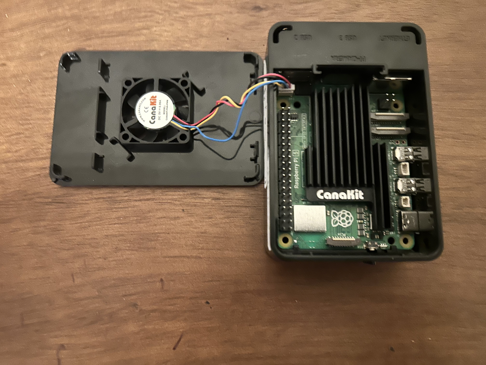

  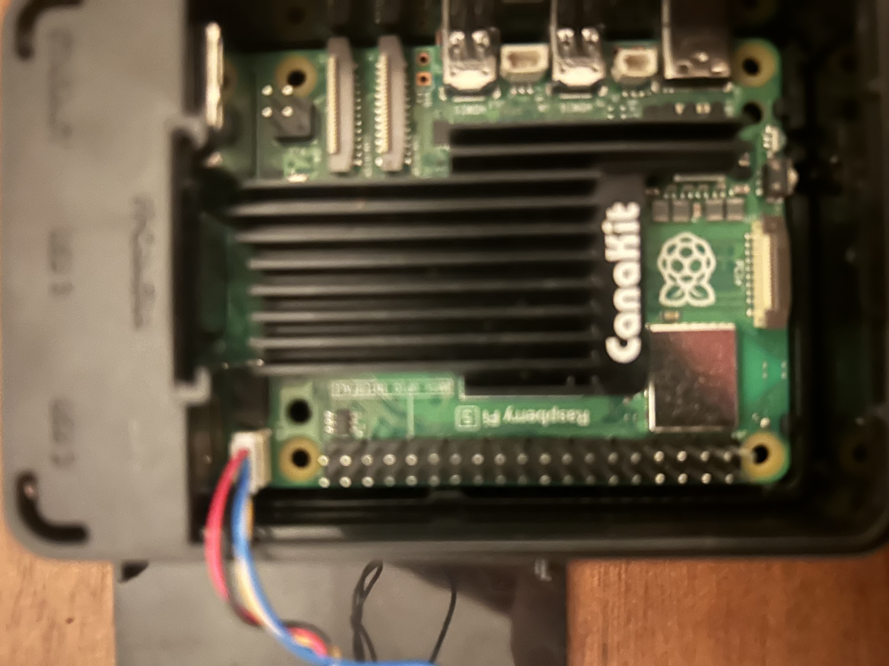

# 2. Hardware assembly and component identification

 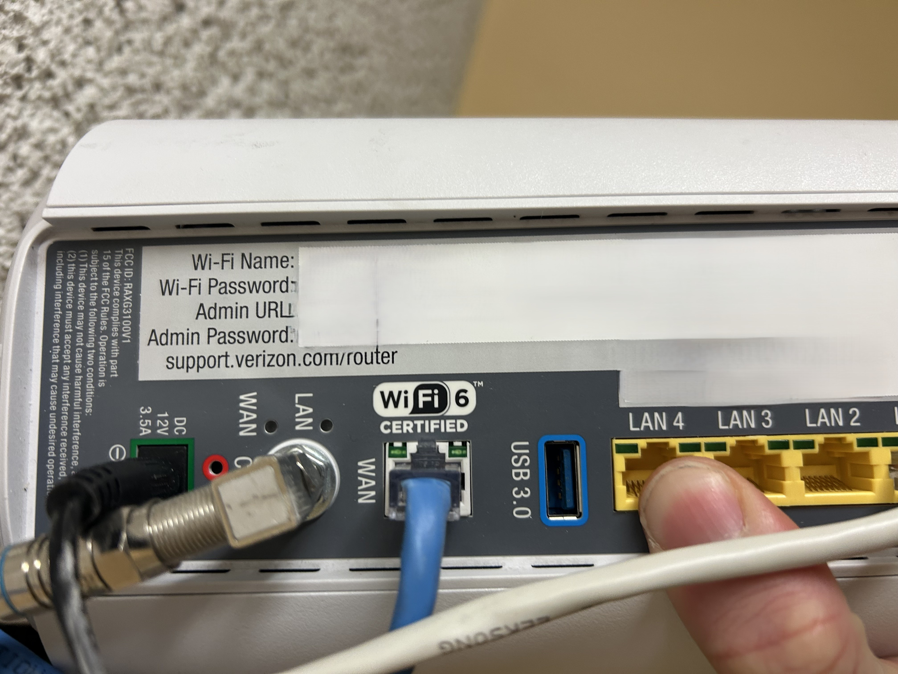

 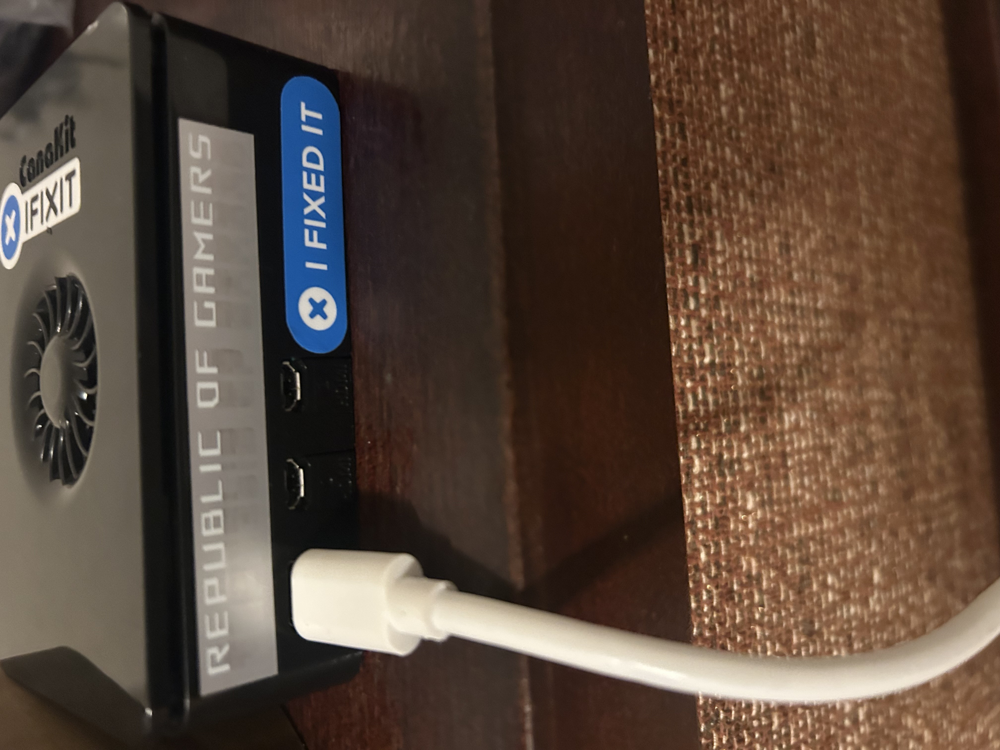

# 3

## Network Diagram and State Diagram

---

Title: Network State Diagram
---

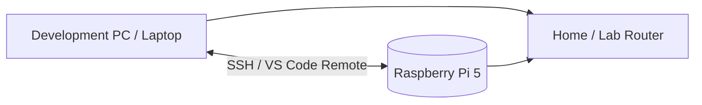

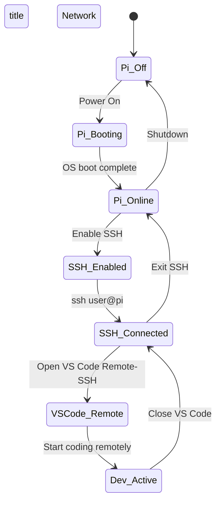

# 4. Configuring your system

## Set Up a New User

 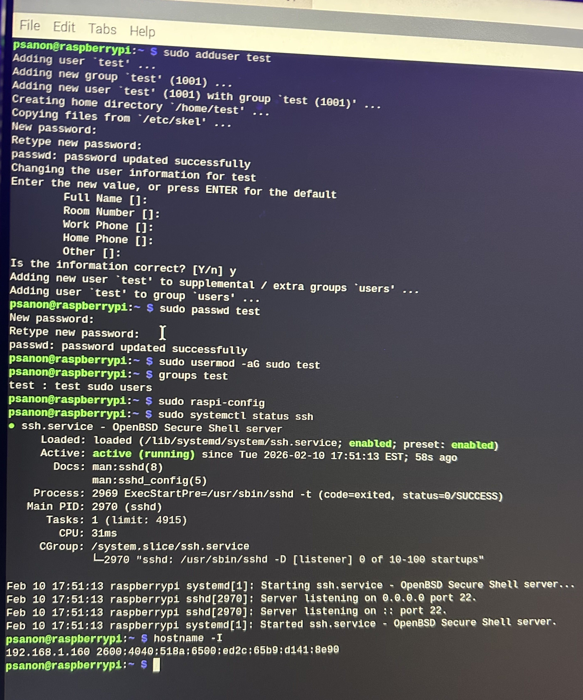

We need to separate "us" as the user and the administrator of the machine. While we do play the role, this is make more sense later on.

1. Open the terminal:
   - Click the terminal icon at the top (`>_`)
   - Alternatively, press `Ctrl + Alt + T`

2. Create and configure the new user:

**WARNING:** The following commands use `sudo` (superuser do), which grants administrator privileges. This is necessary to create users and modify system permissions.

```bash
sudo adduser <username>
sudo passwd <username>
sudo usermod -aG sudo <username>
```

1. Verify the user was added to the sudo group:

```bash
groups <username>
# or
sudo grep '^sudo:' /etc/group
```

**Note:**

- Replace `<username>` with your desired username
- You'll be prompted to enter your current password, then set a password for the new user
- The `adduser` command may ask for additional information (full name, etc.) - you can press Enter to skip these fields

# 5. Network Configuration (SSH setup and security)

## Configure SSH for Remote Access

SSH (Secure Shell) allows you to access your Raspberry Pi remotely from another computer. This is useful for development with tools like VS Code's Remote SSH extension.

### Enable SSH

 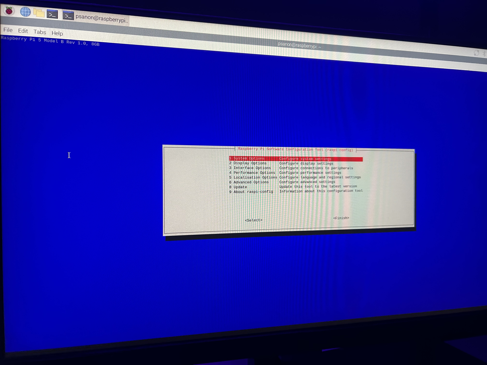

1. Open the Raspberry Pi Configuration tool:

```bash
   sudo raspi-config
```

1. Navigate through the menu:
   - Select `Interface Options` (use arrow keys to navigate)
   - Select `SSH`
   - Select `Yes` to enable SSH
   - Select `OK` to confirm
   - Select `Finish` to exit

    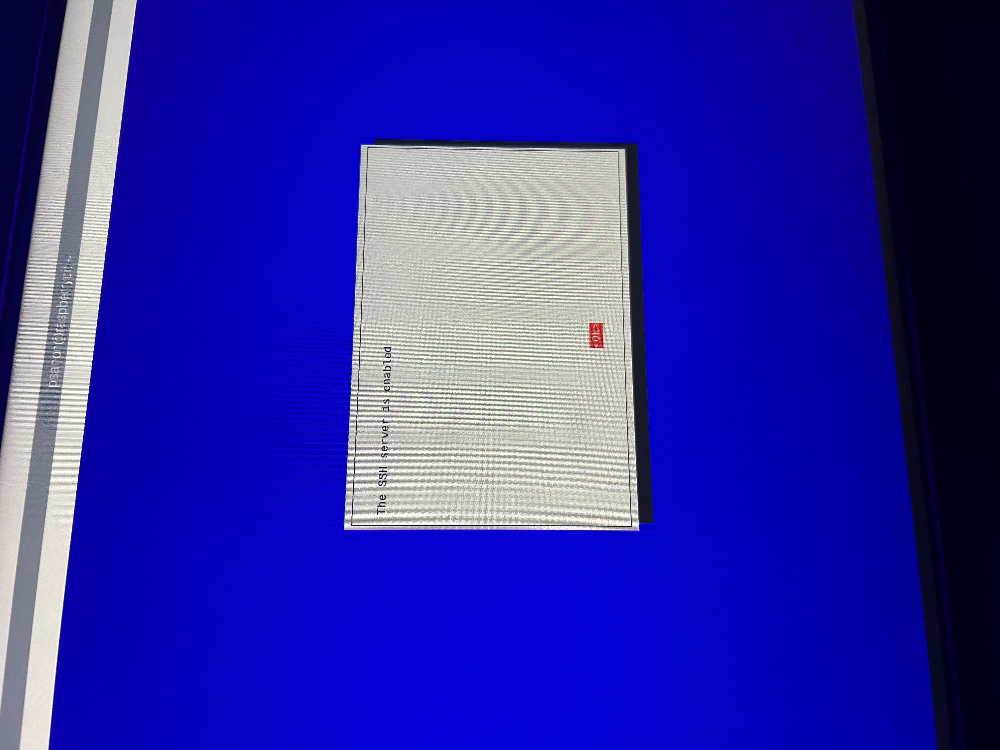

2. Verify SSH is running:

```bash
   sudo systemctl status ssh
```

   You should see `active (running)` in green text. Press `Q` to exit this view.

### Find Your Raspberry Pi's IP Address

You'll need this IP address to connect from your other computer:

```bash
hostname -I
```

This will display your Pi's IP address (e.g., `192.168.1.100`). **Write this down** - you'll need it to connect remotely.

### Connect from Your Development Machine

**From Windows/Mac/Linux:**

1. Open a terminal or command prompt on your development computer

2. Connect using SSH:

```bash
   ssh <username>@<ip-address>
```

   **Example:**

```bash
   ssh pi@192.168.1.100
```

1. When prompted, type `yes` to accept the fingerprint

2. Enter the password you created for this user

**Note:** Once connected, you'll see your Raspberry Pi's command prompt, confirming you're controlling it remotely.

`Ex Enter:`<username>@<ip-address>` (e.g., `pi@192.168.1.100`)`

1. Enter your password when prompted

   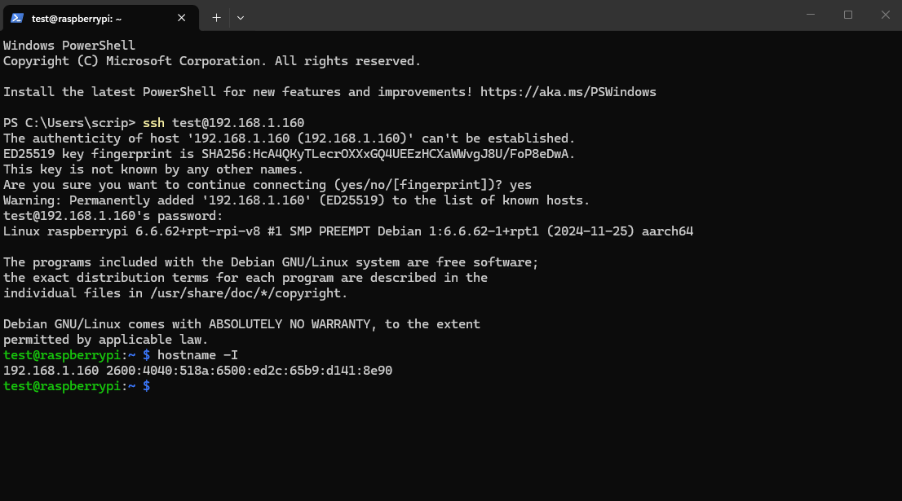

# 6.  Pi VSCode Download/ Extension

 1. **Install the "Remote - SSH" extension in VS Code** on your development machine

### Macintosh

 Press `Ctrl + Shift + P` (or `Cmd + Shift + P` on Mac)
  Type "Remote-SSH: Connect to Host" and select it

### Windows

     Open VS Code on your computer.
    - Go to the Extensions view (`Ctrl+Shift+X or Cmd+Shift+X`).
    - Search for "Remote - SSH" and install the extension published by Microsoft.
    - A new remote icon (a network plug) will appear in your left sidebar.

    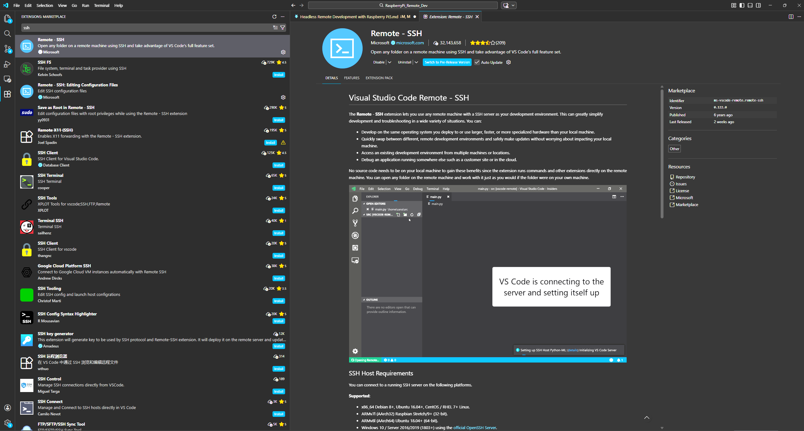

 2. **Connect to Your Raspberry Pi**
    - Click on the Remote Explorer icon in the sidebar.
    - Hover over the **SSH** section and click the `+` icon to add a new host.
    - Enter the SSH connection command using your Pi's credentials: `ssh <username>@<hostname_or_ip_address>` (e.g., `ssh pi@raspberrypi.local` or `ssh pi@192.168.1.100`).
    - Press Enter and select a configuration file when prompted (usually the default user folder one). The host is now saved.

    

 3. **Establish the Connection**
    - In the Remote Explorer, under the SSH menu, find your new host entry.
    - Click the "Connect to host in new window" icon (looks like a new window next to the host name).
    - A new VS Code window will open and attempt to connect.
    - If prompted to confirm the host's authenticity, type `yes` in the terminal.
    - Enter your Raspberry Pi's password when requested.

    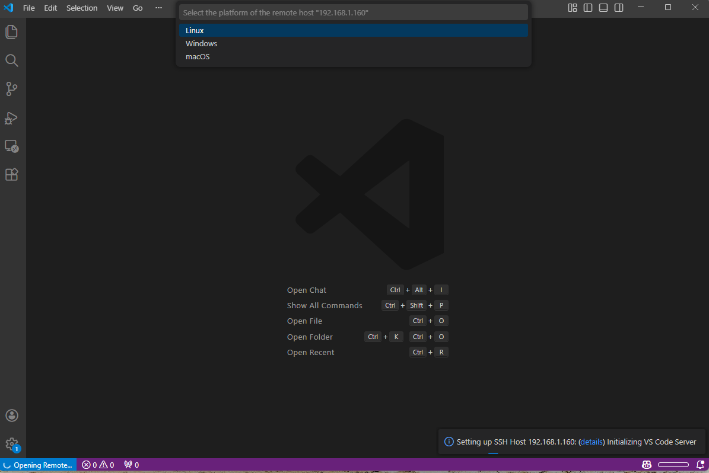

 4. **Start Coding Remotely**
    - Once connected, the green bar in the bottom-left corner of the VS Code window will indicate the active SSH connection.
    - In the Explorer sidebar, click **Open Folder**. A file explorer for your Raspberry Pi's file system will appear.
    - Navigate to your desired project folder (e.g., `/home/pi/Documents`) and click **OK**.
    - You can now create, edit, and run files directly on the Raspberry Pi using the familiar VS Code interface and its integrated terminal. Any command run in the terminal executes on the Pi itself.

    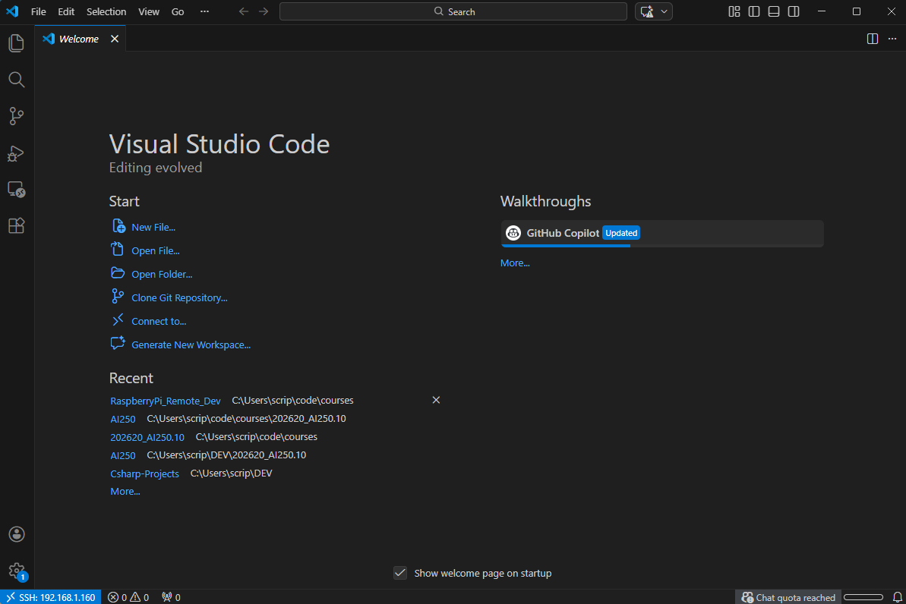

# 7. Testing and Verification

### Real time changes

 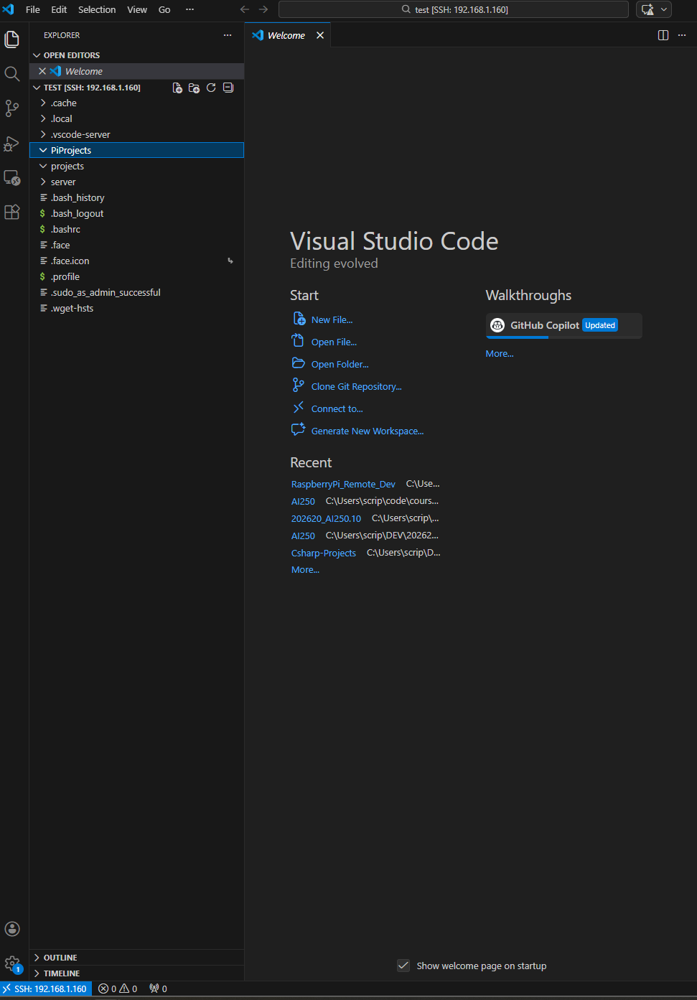
