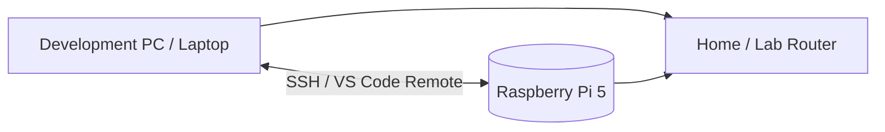
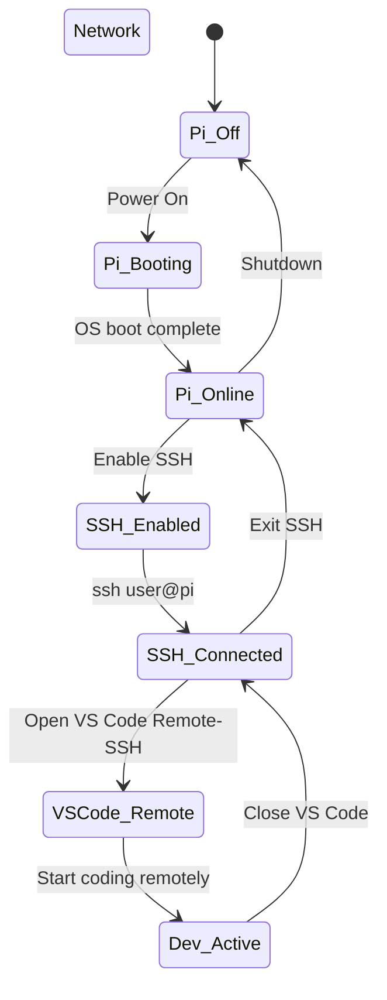
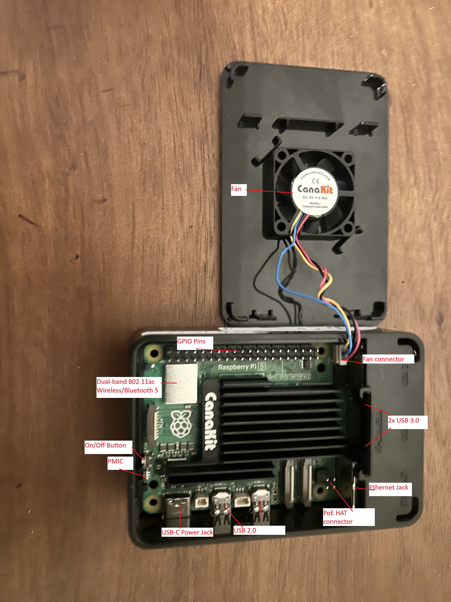

By: Jacob Platt

# Table of Contents

---

1. Introduction and prerequisites to Raspberry Pi Setup
2. Hardware assembly and component identification
3. Operating system installation (Raspberry Pi OS)
4. Initial system configuration
5. SSH setup and security
6. VS Code remote development setup
7. Troubleshooting
8. Next steps and resources

---

# 1. Introduction and prerequisites to Raspberry Pi Setup

Modern software development increasingly relies on small, low-power computers embedded in devices from smart home sensors to industrial monitors. The Raspberry Pi 5 is one of the most accessible entry points into the Internet of Things hobby, combining the power of a full Linux computer with the physical size of a credit card and a price point under $100 USD. This procedure guides you through setting up your Raspberry Pi 5 for headless remote development, a minimal  configuration where the Pi runs without a permanently attached monitor, keyboard, or mouse. Instead, you will control it entirely from your personal computer using Visual Studio Code, just as professional developers manage remote servers in industry.

"Headless" refers to a computer operating without a directly connected display. Once configured, your Raspberry Pi will sit quietly on your desk or network rack while you write, run, and debug code on it from any other computer on your network. This approach offers several advantages for beginner developers and familiarizes them with standard development practices over SSH used in professional software and embedded systems engineering. 

> **📝 Note:** Despite being a *headless* setup, this procedure requires a monitor, keyboard, and mouse for initial configuration. These peripherals are only needed during the first-time setup covered in **Sections 3 and 4**. Once SSH is enabled and your network connection is confirmed, the monitor and keyboard can be permanently disconnected.


---

Network State Diagram






*Diagram 1*: Network State Diagram

---

### `🪛` Item's Required / Description 

| Item                            | Specification / Notes                                                                                                         |     |
| ------------------------------- | ----------------------------------------------------------------------------------------------------------------------------- | --- |
| Raspberry Pi 5 Board            | This procedure is written for the Pi 5. Steps are largely compatible with the Pi 4 but screenshots may differ.                |     |
| Raspberry Pi Case               | Any case compatible with the Raspberry Pi 5 form factor                                                                       |     |
| MicroSD Card                    | 16GB minimum, 32GB recommended. Class 10 / A1 or faster.                                                                      |     |
| MicroSD Card Reader             | USB adapter for writing the OS image from your computer                                                                       |     |
| USB-C Power Supply              | **5V/5A (25W) rated** — the Raspberry Pi 5 requires more power than previous models. Underpowered supplies cause instability. |     |
| Micro HDMI to HDMI Cable        | Note: *Micro* HDMI, not standard HDMI                                                                                         |     |
| Ethernet Cable                  | Cat5 or better; connects Pi to your router for initial setup                                                                  |     |
| USB Keyboard                    | Any standard USB keyboard                                                                                                     |     |
| USB Mouse                       | Optional but recommended for first-boot configuration wizard                                                                  |     |
| Monitor with HDMI Input         | Required for initial setup only                                                                                               |     |
| Development Computer            | Windows, macOS, or Linux — used to write the OS image and connect remotely via VS Code                                        |     |
| Small Phillips head screwdriver | Used for assembly of case                                                                                                     |     |


> **⚠️ WARNING:** The Raspberry Pi 5 requires a **5V/5A USB-C power supply**.
> Using a phone charger or any supply rated below 5A will cause under-voltage
> warnings and unpredictable behavior. Check your power supply's label before > connecting. --- Once you have confirmed all items are present, proceed to **Section 2: Hardware Assembly and Component Identification**.

---
# 2. Hardware assembly and component identification

Before powering on your Raspberry Pi, you must assemble the hardware correctly. This section walks through identifying each component and assembling them in the correct order. "Rushing this step or connecting power before assembly is complete is the most common cause of hardware damage" (Raspberry Pi Foundation, 2025).

| Component                        | Description                                                                                             |
| -------------------------------- | ------------------------------------------------------------------------------------------------------- |
| Raspberry Pi 5 Board             | The main computer. Handle only by the edges — avoid touching the green circuit board or metal contacts. |
| Raspberry Pi Case (Top + Bottom) | Protective enclosure. Typically two or three pieces that snap together.                                 |
| MicroSD Card                     | Stores the operating system. Fragile — avoid bending or touching the gold contacts.                     |
| USB-C Power Cable                | Powers the Pi. Must be rated for **5V/5A** for the Raspberry Pi 5.                                      |
| Micro HDMI to HDMI Cable         | Connects the Pi to a monitor. Note: this is *Micro* HDMI, not standard HDMI.                            |
| Heatsinks (if included)          | Small metal pads that stick to chips on the board to dissipate heat.                                    |
| Cooling Fan (if included)        | Attaches to the case lid and connects to the board's fan header.                                        |
| Ethernet Cable                   | Connects the Pi to your router or network switch for a wired internet connection.                       |

> **🖐️ Handling Note:** Always handle the Raspberry Pi 5 by its edges. Avoid touching the green PCB surface or any metal contacts — static discharge can permanently damage the board.

> **⚠️ WARNING:** Never connect power to your Raspberry Pi until all components are fully assembled. Connecting power prematurely can permanently damage the board and void your warranty.

## 2.1 Component Identification 

Before assembling, lay all components on a clean, flat, static-free surface and confirm you have each item listed below. Refer to the image below to identify each part.

 
*Figure 1: All required components connected post assembly*

> **📝 Note:** The Raspberry Pi 5 uses **Micro HDMI**, not the full-size HDMI port > found on most TVs and monitors. Using the wrong cable or forcing a connection > will damage the port. Verify your cable before connecting.


## 2.2 Installing Heatsinks
Heatsinks reduce the operating temperature of the processor and memory chips, which prevents thermal throttling — a condition where the Pi automatically slows itself down to avoid overheating. 

> **⚠️ WARNING:** Heatsinks have a peel-off adhesive backing. Do not touch the > adhesive side — skin oils reduce thermal conductivity and adhesion strength. 

1. Identify the chips on the Raspberry Pi board that correspond to your heatsink sizes. The largest chip in the center of the board is the processor (SoC). Smaller chips nearby are the memory and power management chips. 
2. Peel the protective film off the adhesive side of the heatsink. 
3. Align the heatsink carefully over the chip — once the adhesive contacts the chip, repositioning will weaken the bond. 
4. Press firmly and hold for 10 seconds to ensure full contact. 
5. Repeat for all remaining heatsinks and chips. 

> **📝 Note:** If your kit includes a thermal pad instead of adhesive-backed heatsinks, place the thermal pad between the heatsink and chip before pressing down. Do not use both. 
## 2.3 Attaching the Cooling Fan 
An active cooling fan provides additional airflow and is recommended for sustained workloads. 
1. Locate the 4-pin fan header on the Raspberry Pi 5 board. It is labeled `FAN` and located near the GPIO pins along the top edge of the board. 
2. Connect the fan's cable to the fan header. The connector is keyed — it will only fit in one orientation. 
3. Do not force it. 
4. The fan will be secured inside the case lid in the next step. 
## 2.4 Assembling the Case 

1. Place the bottom half of the case on your work surface. 
2. Lower the Raspberry Pi board into the bottom case half. The ports (USB, HDMI, Ethernet) should align with the cutouts on the side of the case. The board will sit flush when correctly seated — do not force it. 
3. If your case includes a fan mounted to the lid, align the lid carefully so the fan sits directly above the processor heatsink. 
4. Press the top and bottom case halves together until they snap securely. You should hear or feel a click on each corner. 
5. If your case includes screws, use your small screwdriver to fasten them now. Do not overtighten — finger-tight plus a quarter turn is sufficient.
## 2.5 Inserting the MicroSD Card 

> **⚠️ WARNING:** Do not insert or remove the MicroSD card while the Raspberry Pi is powered on. This can corrupt the operating system and require a complete reinstallation. 

1. Ensure the Raspberry Pi is **not connected to power**. 
2. Hold the MicroSD card with the gold contacts facing down and the angled corner oriented toward the board. 
3. Slide the card into the MicroSD slot on the underside of the board until you feel it click into place.

>**📝 Note:** You will insert the MicroSD card *after* writing the operating system to it in Section 3. If you have not yet installed the OS, proceed to Section 3 first and return here when instructed.

 
1. **Ethernet Cable** — Insert one end into the Raspberry Pi's Ethernet port and the other into your router or network switch. A wired connection is strongly recommended over Wi-Fi for initial setup — it is more reliable and eliminates a potential source of connection problems. 
2. **Micro HDMI to HDMI Cable** — Connect the Micro HDMI end to port labeled `HDMI0` on the Raspberry Pi (the port closest to the USB-C power port). Connect the other end to your monitor.
3. USB Keyboard, Insert into any USB port. 
4. USB Mouse, Insert into any USB port. 
5. USB-C Power Cable **Connect last**. The Raspberry Pi will begin booting immediately when power is connected. There is no physical power button. 

>**📝 Note:** The Raspberry Pi 5 has two Micro HDMI ports. Use `HDMI0`  (the port nearest to the power connector) as your primary display output.  Using `HDMI1` during initial setup may result in no display output. Once all peripherals are connected and power is supplied, you should see a rainbow splash screen appear on your monitor within a few seconds, followed by the Raspberry Pi OS boot sequence. If no image appears on your monitor within 30 seconds, refer to the troubleshooting note below. 


---

 

*Figure 2: Power connected Raspberry Pi post assembly*
 
 
*Figure 3: Network Router LAN ports for Raspberry Pi Ethernet Connection*
 
 ---
# 3. Operating system installation (Raspberry Pi OS)

#### Items Required
- MicroSD Card
- CanaKit MicroSD Reader
- Windows, MAC, or Linux PC

> **📝 Note:** If you have no other computer to write an image to a boot device, you may be able to install an operating system [directly on your Raspberry Pi from the internet](https://www.raspberrypi.com/documentation/computers/getting-started.html#install-over-the-network).


## 3.1 Installing the OS onto the MicroSD

1. Plug the microSD reader into a USB port on your computer
2. Choose the appropriate Raspberry Pi device, for this I will choose Raspberry Pi 5
3. For OS, select Raspberry Pi OS (64-bit) *1.2 GB Download*
	1. For a smaller, lightweight OS install try Raspberry PI OS other> Raspberry Pi OS Lite (64-Bit) *487.4MB Download*
4. Select Storage Device, then remove the SD card from the Raspberry Pi and insert it into the MicroSD reader. Keep exclude system drives checked so the options are filtered, we do not want to install the OS on a system drive. We want the removeable micro SD card to hold the operating system.  
## 3.2 Preconfigure Settings

1. You can preconfigure: 
	- The time zone
	- Your keyboard layout
	- A username and password
	- Wi-Fi credentials
	- Remote connectivity
	- Raspberry Pi Connect 
	
> **📝 Note:** *Raspberry Pi Connect* is Raspberry Pi's official remote access service. It creates a secure tunnel through RP's cloud infrastructure allowing full remote desktop access through the browser, with remote shell via `connect.raspberrypi.com` with a raspberry pi account. This connection is better for quick access from anywhere as it does not require great performance. SSH overall is better for low latency, fast file access on the same local network

## 3.3 Set device Hostname

1.  In the **Customization > Hostname** tab, enter a host name for your Raspberry Pi that includes only letters, numbers, and hyphens. Select **Next**.
2. Your Raspberry Pi broadcasts this host name to the network using [mDNS](https://en.wikipedia.org/wiki/Multicast_DNS). When you connect your Raspberry Pi to your network, other devices on the network can communicate with your computer using `<hostname>.local` or `<hostname>.lan`.
---
# 4. Configuring your system

1. Unplug your Raspberry Pi’s power supply to ensure that the Raspberry Pi is powered down while you connect peripherals. 
2. If you installed the operating system on a microSD card, you can plug it into your Raspberry Pi’s card slot now. 
3. Already completed customization steps with Pi imager will load

> **📝 Note:** If you customized your Raspberry Pi’s operating system as part of the installation process in Imager, congratulations, your device is ready to use. Proceed to [next steps](https://www.raspberrypi.com/documentation/computers/getting-started.html#next-steps) to learn how you can put your Raspberry Pi to good use.

If your Raspberry Pi does not boot within 5 minutes, check the status LED. If it’s flashing, see the [LED warning flash codes for more information](https://www.raspberrypi.com/documentation/computers/configuration.html#led-warning-flash-codes). If your Pi refuses to boot, refer to step 8 for troubleshooting

## 4.1 Set Up a New User

It is bad practice to use default administrator accounts for routine tasks as it increases the risk of compromising your system. Instead create a user account and add them to the sudo group. 

1. Open the terminal:
   - Click the terminal icon at the top (`>_`)
   - Alternatively, press `Ctrl + Alt + T`

2. Create and configure the new user:

> **⚠️ WARNING:** The following commands use `sudo` (superuser do), which grants administrator privileges. This is necessary to create users and modify system permissions.

```bash
sudo adduser <username>
sudo passwd <username>
sudo usermod -aG sudo <username>
```

3. Verify the user was added to the sudo group:

```bash
groups <username>
# or
sudo grep '^sudo:' /etc/group
```


> **📝 Note:**  Replace `<username>` with your desired username. You'll be prompted to enter your current password, then set a password for the new user. The `adduser` command may ask for additional information (full name, etc.) You can press Enter to skip these fields

 
*Figure 4: Raspberry Pi Terminal showing required commands*


---
# 5. SSH Setup & Security

SSH (Secure Shell) allows you to access your Raspberry Pi remotely from another computer. This is useful for development with tools like VS Code's Remote SSH extension. Some advantages of using SSH include "encrypting traffic to eliminate eavesdropping, connection hijacking, among other attacks while providing a large suite of secure tunneling capabilities, authentication, and configuration options" (OpenSSH, 2025).


> **📝 Note:**  Replace `<username>` with your desired username. You'll be prompted to enter your current password, then set a password for the new user. The `adduser` command may ask for additional information (full name, etc.) - you can press Enter to skip these fields

## 5.1 Enable SSH

1. Open the Raspberry Pi Configuration tool:

```bash
   sudo raspi-config
```

1. Navigate through the menu:
   - Select `Interface Options` (use arrow keys to navigate)
   - Select `SSH`
   - Select `Yes` to enable SSH
   - Select `OK` to confirm
   - Select `Finish` to exit
 
*Figure 5: raspi-config menu*

2. Verify SSH is running:

```bash
   sudo systemctl status ssh
```

   You should see `active (running)` in green text. Press `Q` to exit this view.


*Figure 6: Confirmation that SSH server is enabled*


## 5.2 Find Your Raspberry Pi's IP Address

You'll need this IP address to connect from your other computer:

```bash
hostname -I
```


> **📝 Note:**  This will display your Pi's IP address (e.g., `192.168.1.100`). **Write this down** - you'll need it to connect remotely.

## 5.3 Connect from Your Development Machine

**From Windows/Mac/Linux:**

1. Open a terminal or command prompt on your development computer

2. Connect using SSH:

```bash
   ssh <username>@<ip-address>
```

   **Example:**

```bash
   ssh pi@192.168.1.100
```

1. When prompted, type `yes` to accept the fingerprint

2. Enter the password you created for this user

> **📝 Note:** Once connected, you'll see your Raspberry Pi's command prompt, confirming you're controlling it remotely.


---
# 6.  Pi VSCode Download/ Extension

1. **Install the "Remote - SSH" extension in VS Code** on your development machine
2. Open VS Code on your computer.
3. Go to the Extensions view (`Ctrl+Shift+X or Cmd+Shift+X`).
4. Search for "Remote - SSH" and install the extension published by Microsoft.
5. A new remote icon (a network plug) will appear in your left sidebar.


*Figure 7: VSCode Extension Remote - SSH*


## 6.1 Connect to your Raspberry Pi

1. Click on the Remote Explorer icon in the sidebar.
2. Hover over the **SSH** section and click the `+` icon to add a new host.
3. Enter the SSH connection command using your Pi's credentials: `ssh <username>@<hostname_or_ip_address>` (e.g., `ssh pi@raspberrypi.local` or `ssh pi@192.168.1.100`).
4. Press Enter and select a configuration file when prompted (usually the default user folder one). The host is now saved.


*Figure 8: Terminal showing SSH connection to my Pi at `192.168.1.160`*

## 6.2 Establish the Connection
 
 1. In the Remote Explorer, under the SSH menu, find your new host entry.
 2. Click the "Connect to host in new window" icon (looks like a new window next to the host name).
 3. A new VS Code window will open and attempt to connect.
 4. If prompted to confirm the host's authenticity, type `yes` in the terminal. Enter your Raspberry Pi's password when requested.


    
*Figure 9: VSCode SSH extension remote host setup*


## 6.3 **Start Coding Remotely**
 
 1. Once connected, the green bar in the bottom-left corner of the VS Code window will indicate the active SSH connection.
 2. In the Explorer sidebar, click **Open Folder**. A file explorer for your Raspberry Pi's file system will appear.
 3. Navigate to your desired project folder (e.g., `/home/pi/Documents`) and click **OK**.
 4. You can now create, edit, and run files directly on the Raspberry Pi using the familiar VS Code interface and its integrated terminal. Any command run in the terminal executes on the Pi itself (Microsoft, 2025).


*Figure 10: Completely connected VSCode SSH to Raspberry Pi 5*


*Figure 11: Access to Raspberry Pi's filesystem through remote headless development over the network*

---

# 7.  Troubleshooting

Throughout this procedure their may be several instances of malfunction. Every Pi is tested for an initial boot before they are sold, but this does not resolve variance in assembly. Through the troubleshooting methodology use the following sections to identify the problem, research solutions and establish a theory to test and correct malfunctions throughout this procedure.

## 7.1 Troubleshoot Hardware Assembly & Components
##### Raspberry Pi will not power on
1. Verify that the MicroSD card is firmly seated in the Raspberry Pi
2. Check that the power supply is connected correctly
3. If video output will not display try using a different HDMI cable

## 7.2 Troubleshoot Operation System Install
##### MicroSD Card Reader
1. Verify the card reader and SD card work on different machines, using different USB ports
2. If the card is unable to be detected in the Imager software, the reader may be defective
##### Unsuitable USB cable
1. Long cables use thin copper wire and may not be suitable for the Rasberry Pi 5. Avoid cables over 6ft in length
## 7.3 Troubleshoot System Configuration
##### Verify Language and Keyboard Settings
1. In the terminal run `sudo raspi-config` to view and edit the configuration menu
2. View [Raspbian OS documentation](https://www.raspberrypi.com/documentation/computers/os.html) for further troubleshooting

## 7.4 Troubleshoot SSH & Security

##### Check SSH Service Status
1. Connect to the Raspberry Pi directly with a monitor/keyboard or through a serial console cable
2. Verify the SSH service is running using the command `sudo systemctl status ssh` or `sudo service ssh status`
##### Verify SSH Configuration
1. Review the SSH daemon configuration file in location `/etc/ssh/sshd_config`
2. Ensure the `Port` line is set to the default expected port 22
##### Resolve "Host Key Verification Failed" Error
1. This occurs when you reinstall the OS or assign a new Pi the same IP address as a previous one
2. Delete the old host key from your client machine in file path `~/.ssh/known_hosts`
##### Check Credentials and Permissions
1. Default username is `pi` with password `password` using SSH keys verify the clients private key matches the server's public key and that file permissions are correct. 
##### Check Server Logs
1. SSH server logs can be found at file location `/var/log/auth.log`, specifically logs for failed connections can be found at `/var/log/secure` 

## 7.5 Troubleshoot VSCode Extension
##### SSH Server not running
1. Reinstall the extension and reset the connection
2. View the extensions documentation

---

# 8.  Next Steps & Additional Resources

Following this technical procedure postures you for headless remote development on the Raspberry Pi 5. 

## 8.1 GPIO from Python

Using the [GPIO Zero](https://gpiozero.readthedocs.io/en/stable/) library we can now control GPIO devices with the Python programming language. 

## 8.2 Pi Pico SDK with CMake

This software development kit uses CMake to manage the build process in order to produce a bare-metal executable, or in other words a standalone binary that includes all the code to run directly on a micro-controller. 

## 8.3 Block ads at home with Pi-hole

[Pi-hole blocks ads](https://www.raspberrypi.com/tutorials/running-pi-hole-on-a-raspberry-pi/) by acting as a DNS sinkhole, or in laymen terms the pi sits on your network and blocks requests from adverting domain names.

## 8.4 Shutdown Procedures

To avoid damage to the Micro-SD card that is running our operating system, proper shutdown is accomplished through the command `sudo shutdown -h now`. 

---
# 9. References

 Raspberry Pi Foundation. (2025). _Raspberry Pi 5 documentation_. [https://www.raspberrypi.com/documentation/](https://www.raspberrypi.com/documentation/)

 Microsoft. (2025). _Visual Studio Code remote development_. [https://code.visualstudio.com/docs/remote/](https://code.visualstudio.com/docs/remote/)

 OpenSSH. (2025). _SSH protocol documentation_. [https://www.openssh.com/](https://www.openssh.com/)
 
 *Images not cited are my own, including screenshots and graphs*