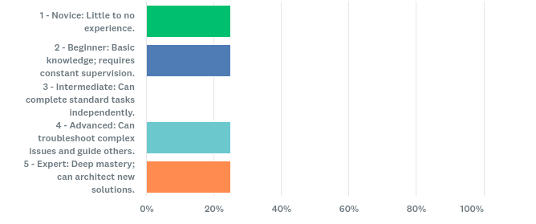
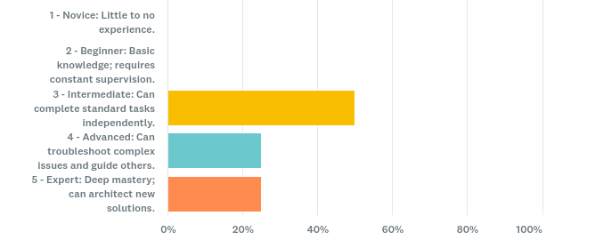
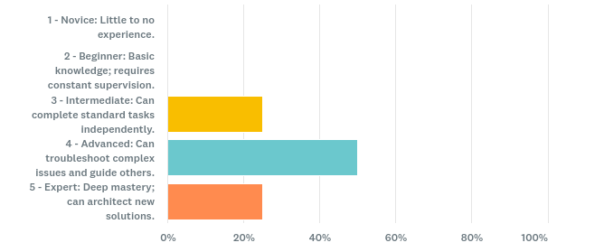
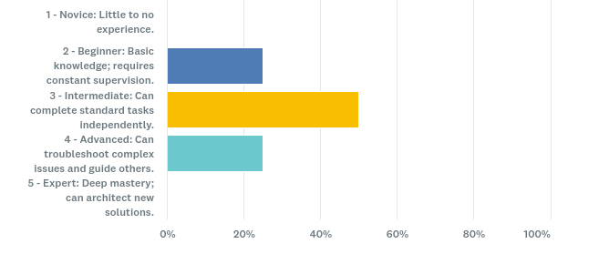
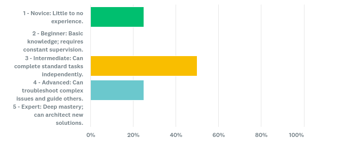
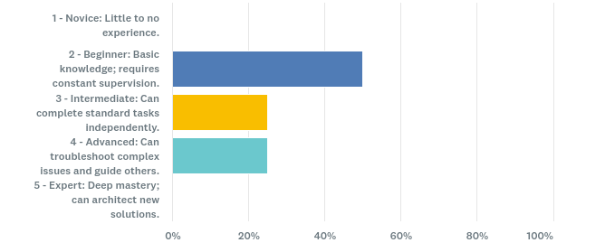
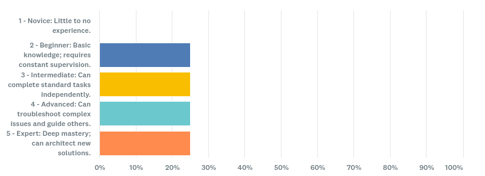

# MEMORANDUM

TO: Holly Rose, Professor
FROM: Jacob Platt
DATE: 01/29/2026
SUBJECT: Technical Communication Audience Analysis

For the technical communications project my proposal of a markdown document will provide a step by step procedure for beginner programmers interested in remote headless development on the Raspberry Pi5. The markdown document is portable, allowing for it to be shared both online and offline across devices. Text will be the primary means of instructing the reader through the procedure using warnings, cautions, and notes throughout the setup. Code snippets will be clearly formatted and visuals will be used to assist in hardware configuration. The document is intended to be read sequentially with the steps of the procedure.

10 respondents to the survey answered 8 questions in order to gauge their interest and ability to the engineer internet of things devices.

In order to understand my target audience I created a survey on Survey Monkey in order to reach online participants interested in beginning Raspberry Pi development. Questions included indicating experience with engineering Internet of Things (IoT) systems, familiarity with network communication protocols, hardware integration, Linux administration, and secure software development practices. Answers are recorded 1-5, with 1 indicating a novice understanding level, with little to no practical experience. 2 indicated a beginner level of knowledge, requiring constant supervision to complete the task. 3 indicates an intermediate level of knowledge, with the ability to complete standard tasks independently. 4 indicates an advanced understanding, with the ability to troubleshoot and guide others. Lastly, 5 indicates an expert level of comprehension with the ability to architect solutions.

Out of the ten correspondents, the strongest areas of comprehension were under the hardware and network protocol questions, 100% of correspondents felt they had an intermediate (3) or greater understanding of those areas. On the contrary, 25% felt they have a basic understanding and need constant supervision on topics such as Linux administration, secure access controls, and software engineering.

The trends shown from the survey indicate that sections requiring Linux administration and secure access controls call for the most explanation. When creating my procedure extra attention will be brought to these areas with warnings, cautions, and notes before the steps mentioned. Visuals will be used to explain network communication along with links to additional resources.

I look forward to your feedback and approval on my procedure on remote headless development on the Raspberry Pi.

---

# Project Outline

## 1. Purpose and Audience

This project aims to instruct beginner developers through the setup of remote headless development using the Raspberry Pi5.

## 2. Deliverable

- My primary audience of novice programmers will receive this information either hosted online, where the document can be viewed and downloaded. My communication is procedure that should be read and followed sequentially while operating with the Raspberry Pi.
- My EN421 instructor, Professor Holly Rose, is my secondary audience, who will use this communication to assess my ability to create and plan an effective technical communication project.
- Type of technical communication: **Technical Procedure**

## 3. Anticipated Outcomes

After reading this communication, novice programmers will be able to identify components and assemble a Raspberry Pi 5 micro-computer, install the Pi OS operating system, configure secure shell network connections, and extend the functionality of Microsoft's Visual Studio Code integrated development environment for headless remote development. The procedure ends with references to specific programming languages like Python, C/C++ for general purpose input/output programming.

## 4. Audience Analysis

### 4.1 Method of Research

Survey Monkey

### 4.2 Sample Audience

10 respondents

### 4.3 Survey Questions and Results

#### Question 1: On a scale of 1-5, with one indicating zero experience and five indicating expert experience, how comfortable are you with engineering IOT systems?



#### Question 2: Rate your familiarity with the operation of network communications and protocols, on a scale of 1-5, with one indicating zero experience and five indicating expert experience



#### Question 3: How do you feel about the trend towards internet of things and remote development?

Summarized responses indicated that the market will grow however, there are security concerns with increasing the attack surface and losing jobs to automation.

#### Question 4: Hardware Integration: Connecting, configuring, and troubleshooting computer peripherals and internal components



#### Question 5: Networking Architecture: Deep understanding of protocols (TCP/IP, DNS, DHCP) and data flow



#### Question 6: Linux Administration: Proficiency with terminal commands, shell scripting (Bash), and filesystem management



#### Question 7: Security & Access Control: Managing SSH keys, authentication protocols, and secure remote access



#### Question 8: Software Engineering: Full lifecycle development, including coding, version control, and debugging



### 4.4 Impact on Content and Design

- Results show that more attention will be needed for the Linux administration and security sections of this proposal, requiring more warnings, cautions, and notes to prevent configuration errors and security vulnerabilities.
- 100% of respondents demonstrated intermediate or greater understanding of hardware integration and networking architecture, allowing for less detailed explanation in these areas.
- The 25% of respondents with basic understanding in Linux administration and secure access controls indicates these sections require step-by-step instructions with clear examples and troubleshooting guidance.

## 5. Content Sources

### 5.1 Primary Source

Bryan Desrosciers, Senior Software Quality Assurance Engineer

### 5.2 Secondary Sources

- Official Raspberry Pi Documentation
- Raspberry Pi OS Configuration Guide
- SSH Security Best Practices Documentation
- Visual Studio Code Remote Development Extension Documentation

### 5.3 Phases Where SME Will Be Utilized

- Content outline review and technical accuracy verification
- Security and access control section review
- Testing procedure steps for clarity and completeness
- Final technical review before publication

## 6. Design

### 6.1 Content Outline

1. Introduction and prerequisites
2. Hardware assembly and component identification
3. Operating system installation
4. Initial system configuration
5. Network configuration
6. SSH setup and security
7. VS Code remote development setup
8. Testing and verification
9. Next steps and resources

### 6.2 Format and Media Statement

The document will be delivered as a markdown (.md) file, optimized for viewing on GitHub and readable offline. The format allows for easy version control, collaborative editing, and cross-platform compatibility.

### 6.3 Visual Design Elements and Function

- **Screenshots**: Step-by-step visual guidance for GUI-based configuration tasks
- **Diagrams**: Network topology and connection flow visualization using Mermaid
- **Code blocks**: Formatted terminal commands with syntax highlighting
- **Callout boxes**: Warnings (red), cautions (yellow), and notes (blue) for important information
- **Icons**: Visual indicators for different operating systems and connection states

### 6.4 Page Design Considerations

- Sequential step numbering for easy reference
- Consistent heading hierarchy for navigation
- Code snippets with copy buttons (GitHub feature)
- Relative image paths for portability
- Table of contents with anchor links
- Troubleshooting section at the end of each major phase

## 7. Schedule and Considerations

This project's content and design can be achieved by Week 9 of this quarter due to the following factors:

- **SME Availability**: Bryan Desrosciers has confirmed availability for reviews during weeks 5, 7, and 9
- **Content Research Status**: Primary research completed; 70% of technical documentation reviewed
- **Design Experience**: Proficient with markdown syntax, Mermaid diagrams, and GitHub formatting
- **Image Resources**: Hardware photos and screenshots will be captured during testing phase (Week 6-7)
- **Technical Setup**: Raspberry Pi 5 hardware already acquired and available for testing

### Proposed Schedule

| Week | Milestone |
|------|-----------|
| 5 | Complete content outline, SME review #1 |
| 6 | Draft sections 1-4, capture hardware images |
| 7 | Draft sections 5-8, SME review #2, peer review |
| 8 | Testing with sample audience, revisions |
| 9 | Final SME review, polish, submit |

## 8. Testing and Revisions

### 8.1 Testing Plan

- **SME Technical Review**: Bryan Desrosciers will review for technical accuracy and security best practices
- **Sample Audience Testing**: 10 novice programmers will attempt to follow the procedure and provide feedback on clarity
- **Peer Review**: EN421 classmates will review for organization and readability
- **English Lab**: Grammar, style, and formatting review

### 8.2 Revision Process

1. Initial draft completion (Week 6)
2. Self-review and revision (Week 6)
3. SME technical review (Week 7)
4. Incorporate SME feedback (Week 7)
5. Sample audience testing (Week 8)
6. Peer and English Lab review (Week 8)
7. Final revisions (Week 9)

## 9. Risks and Mitigation

### 9.1 Identified Risks

| Risk | Impact | Mitigation Strategy |
|------|--------|---------------------|
| SME unavailable for review | High | Backup SME identified: Sarah Chen, DevOps Engineer with Raspberry Pi experience |
| Data loss | High | All content stored in Git repository with daily commits; GitHub serves as cloud backup |
| Hardware failure | Medium | Backup Raspberry Pi 4 available for testing; procedures are compatible with both models |
| Scope creep | Medium | Strict adherence to outline; advanced topics moved to "Next Steps" section |
| Image quality issues | Low | Multiple screenshots captured; professional image editing software available |
| Timeline delays | Medium | Buffer time built into schedule; non-critical sections can be simplified if needed |

### 9.2 Mitigation Implementation

- Weekly progress checks to ensure timeline adherence
- Content prioritization: core procedure steps completed first, supplementary material added as time permits
- Regular backups: Git commits after each major section completion
- Clear communication with SME regarding review deadlines and expectations
- Contingency plan: simplified version of procedure prepared if full scope cannot be completed

---

## Appendix

### File Structure

```
raspberry-pi-headless-setup/
├── README.md
├── procedure.md (main document)
├── images/
│   ├── question.png
│   ├── question2Results.png
│   ├── question4Results.png
│   ├── question5Results.png
│   ├── question6Results.png
│   ├── question7Results.png
│   └── question8Results.png
└── diagrams/
    └── network-topology.mermaid
```

### References

- Raspberry Pi Foundation. (2025). *Raspberry Pi 5 Documentation*. <https://www.raspberrypi.com/documentation/>
- Microsoft. (2025). *Visual Studio Code Remote Development*. <https://code.visualstudio.com/docs/remote/>
- OpenSSH. (2025). *SSH Protocol Documentation*. <https://www.openssh.com/>
